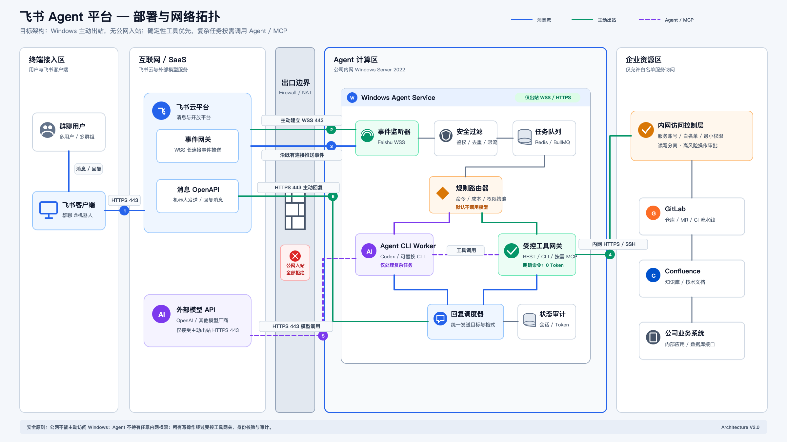
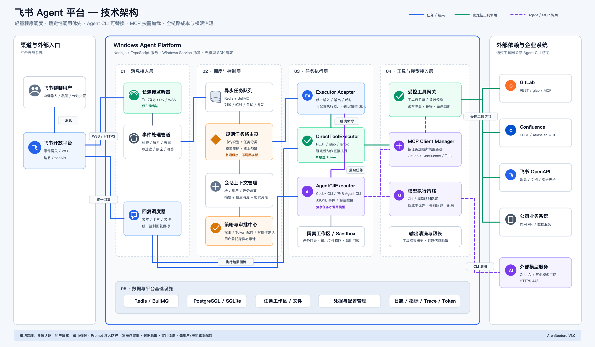

# 飞书 Agent 平台架构方案

本仓库记录一套面向企业内网场景的飞书 Agent 平台设计：用户在飞书群聊中与机器人交互，Windows Agent 服务器处理任务，并按需访问公司内网系统和外部模型服务。

## 设计目标

- 支持多用户、多群聊并发使用。
- Windows 服务器可以访问互联网和公司内网，但不接受公网主动访问。
- 明确命令优先调用 REST API 或 CLI，避免不必要的模型 Token 消耗。
- 复杂任务才进入 Agent CLI，并允许后续替换 Codex 或其他 Agent。
- GitLab、Confluence、飞书等能力可通过 REST、CLI 或 MCP 接入。
- 对身份、权限、写操作、Token 成本和任务执行过程进行统一治理与审计。

## 网络拓扑



关键网络原则：

1. Windows 服务器主动向飞书建立 WSS 443 长连接。
2. 飞书事件沿已经建立的长连接推送给 Windows，不需要公网回调地址。
3. Windows 通过 HTTPS 443 主动调用飞书 OpenAPI 回复消息。
4. Windows 主动访问外部模型服务，不开放公网入站端口。
5. GitLab、Confluence 和业务系统仅通过公司内网白名单接口访问。
6. 不需要云 Router、端口映射、反向代理或公网 IP。

矢量版本：[network-topology-v2.svg](diagrams/network-topology-v2.svg)

## 技术架构



矢量版本：[technical-architecture-v1.svg](diagrams/technical-architecture-v1.svg)

### 1. 消息接入层

- 飞书官方 SDK 建立 WSS 长连接。
- 完成事件验签、解析、去重、限流和幂等控制。
- 只处理私聊、`@机器人` 或明确配置的命令。
- 所有消息回复统一经过回复调度器，Agent 不能自行决定回复目标。

### 2. 调度与控制层

- Redis + BullMQ 负责异步任务、削峰、并发控制和失败重试。
- 规则任务路由器是普通程序，不依赖模型做基础分类。
- 会话上下文按群、用户和任务隔离。
- 策略中心负责权限校验、Token 配额、写操作确认和审计。

### 3. 任务执行层

平台通过统一的 `Executor Adapter` 调度不同执行器，不直接绑定模型 SDK：

- `DirectToolExecutor`：调用 REST API、`glab`、`lark-cli` 或内部接口，明确任务不消耗模型 Token。
- `AgentCliExecutor`：调用 Codex CLI 或其他 Agent CLI，仅处理代码分析、复杂推理和跨系统任务。
- Sandbox：为每个任务提供隔离工作目录、最小文件权限和超时回收能力。

### 4. 工具与模型接入层

- 受控工具网关负责工具白名单、参数校验、读写隔离、幂等和结果截断。
- MCP Client Manager 按任务加载 GitLab、Confluence 或飞书 MCP，避免一次性暴露全部工具。
- 模型执行策略通过配置选择 CLI 和模型，支持低成本模型优先、失败回退和配额限制。
- 工具结果在进入模型前进行限长、摘要和敏感信息脱敏。

## CLI、REST 与 MCP 的选择原则

| 场景 | 推荐方式 | 模型 Token |
| --- | --- | ---: |
| `/gitlab mr 123` 等明确命令 | REST / `glab` | 0 |
| 指定页面查询、固定数据读取 | REST / 专用 CLI | 0 |
| 代码分析和修改 | Codex CLI | 按任务产生 |
| 自然语言选择多个外部工具 | Agent CLI + 按需 MCP | 按任务产生 |
| 外层模型再调用 Codex MCP | 第一阶段不采用 | 通常最高 |

CLI 和 MCP 本身不是 Token 计费单位。主要成本来自模型输入上下文、工具描述、工具返回内容、模型输出和失败重试。直接调用 Agent CLI 可以避免额外的外层调度模型。

## Token 成本控制

- 明确命令绕过模型。
- 群聊中只响应 `@机器人`、私聊和指定命令。
- 只传入最近消息、会话摘要和必要的检索片段。
- 对 Git diff、流水线日志和文档内容先过滤、再摘要。
- 每次只加载当前任务所需的 MCP Server 和工具。
- 限制工具返回大小、模型输出长度和自动重试次数。
- 按用户、群组、任务类型和模型记录 Token 使用量及成本。
- 写操作使用幂等键，避免回退或重试造成重复修改。

## 安全要求

- 公网入站全部关闭，只允许必要的出站 WSS/HTTPS。
- 飞书、GitLab、Confluence 和内部系统使用独立服务账号与最小权限。
- 读取工具和写入工具分离。
- 合并 MR、修改生产文档和执行高风险命令必须二次确认。
- 凭据保存在 Windows Credential Manager 或企业密钥管理系统中。
- 工作目录隔离，限制 Agent 可以访问的仓库、路径和命令。
- 记录消息事件、任务路由、工具调用、写操作审批和成本审计日志。

## 建议技术栈

- Windows Server 2022
- Node.js + TypeScript
- 飞书官方 Node SDK
- Redis + BullMQ
- PostgreSQL；小规模试运行可先使用 SQLite
- Codex CLI；后续可增加其他 Agent CLI Adapter
- `glab`、`lark-cli`、GitLab REST、Confluence REST
- GitLab MCP、Atlassian MCP、飞书 MCP（按需启用）
- WinSW 或 Windows Service 托管

## 仓库结构

```text
.
├── README.md
└── diagrams
    ├── network-topology-v2.png
    ├── network-topology-v2.svg
    ├── technical-architecture-v1.png
    └── technical-architecture-v1.svg
```

## 当前状态

当前仓库为架构设计阶段，尚未包含生产代码。建议下一阶段优先实现：

1. 飞书长连接事件监听与消息回复 PoC。
2. 规则路由器和 BullMQ 任务队列。
3. `DirectToolExecutor` 与 `AgentCliExecutor` 统一接口。
4. GitLab、Confluence 和飞书的只读工具接入。
5. 权限审批、Token 预算和全链路审计。
