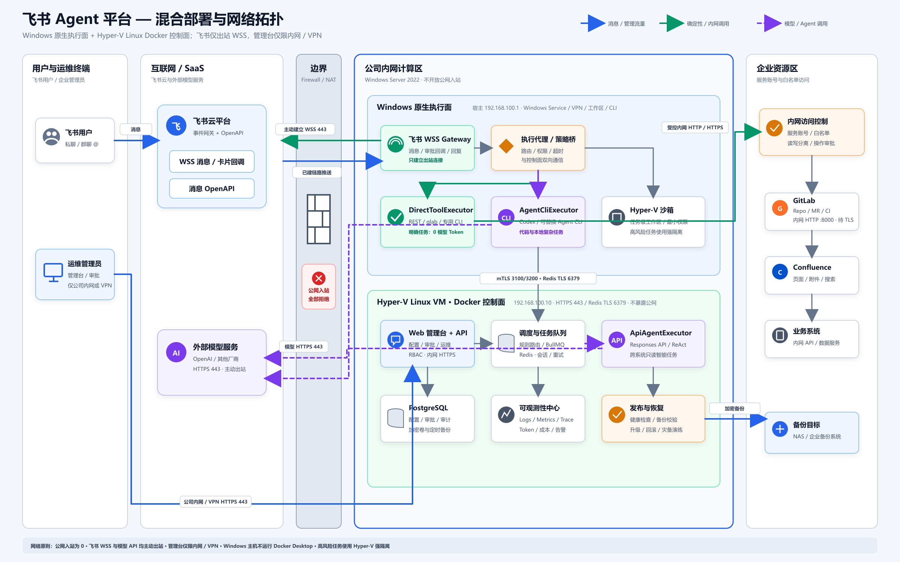
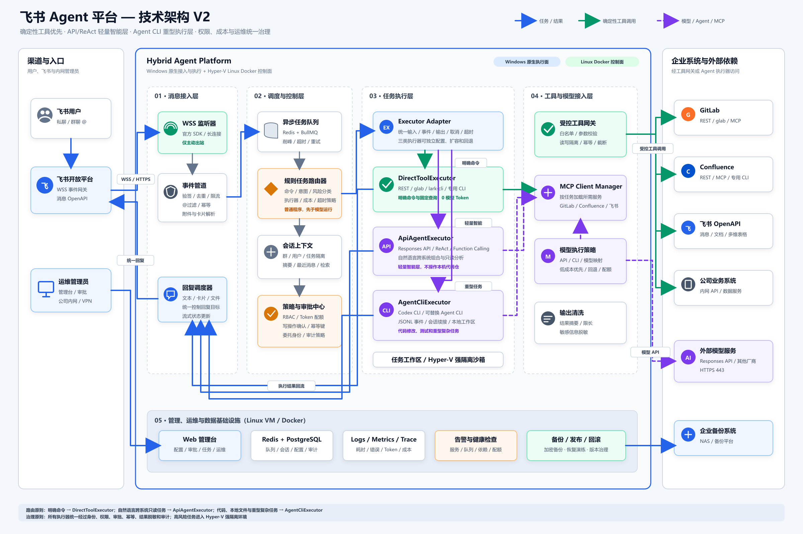

# 飞书 Agent 平台架构方案

本仓库记录一套面向企业内网的飞书 Agent 平台设计。用户在飞书群聊或私聊中与机器人交互，平台按任务特征选择确定性工具、可选 API/ReAct 或本地 Agent CLI，并统一治理身份、权限、审批、Token 成本和执行审计。API/ReAct 通道当前关闭。

## 当前状态

项目已经进入实施阶段。P0 工程基线、P1 飞书接入 PoC、P2 调度与数据、P3 执行器层、P4 企业系统只读接入和 P5 治理与审批均已完成本地、真实联调与远端门禁验收并关闭。P6 管理台与运维已完成本地实现和运行态验收，等待界面视觉确认、提交推送及远端门禁。已完成内容包括：

- pnpm/TypeScript 单体仓库、4 个应用和 7 个共享包。
- 任务、执行器、风险和健康检查共享契约。
- 任务状态机、统一 Executor Adapter 与首个 PostgreSQL migration。
- Control API、Feishu Gateway、Windows Worker 健康服务和 P6 完整管理台。
- 单元测试、构建、GitHub Actions、依赖审计和密钥扫描。
- WSL2、Docker Engine/Compose、PostgreSQL、Redis 和数据库 migration 实机验收。
- DirectTool、Responses API/ReAct 和 Agent CLI 的统一事件、错误、取消、超时、回退与熔断实现。
- Codex CLI JSONL、会话续接、授权工作区、Windows ACL、任务清理和执行审计。
- 企业接入共享白名单、有限重试、限流分类、响应上限和敏感信息脱敏。
- GitLab、Confluence、飞书只读适配器及 `/gitlab`、`/confluence`、`/feishu` 零模型命令。
- Confluence CQL、页面、附件元数据、评论和越权拒绝的本机真实全链路验收。
- 飞书新版文档、多维表格、测试群和精确白名单用户的真实只读验收。
- GitLab 仅 `read_api` 令牌、11 个项目、MR、分页差异、流水线和 Control API 全链路真实验收。
- P5 持久化 RBAC、职责分离、审批状态机、写操作幂等、分层预算、脱敏审计和 Windows Credential Manager 凭据引用。
- Control API 到飞书网关的回环审批卡片发送，以及真实 WSS `card.action.trigger` 立即终态响应、异步更新兜底、单卡单终态和共享更新验收；终态保留原审批详情，状态中文化，时间使用北京时间 `yyyy-MM-dd HH:mm:ss`。
- 管理台 14 个数据驱动页面、管理驾驶舱、角色管理和内置操作说明书；普通成员与超级管理员均只通过飞书 OAuth v3 + PKCE + HttpOnly 平台会话登录，服务端按角色过滤页面与数据。

当前架构基线：

- 飞书使用 WSS 443 长连接，Windows 服务器不开放公网入站端口。
- 明确命令优先直接调用 REST API 或 CLI，不经过模型。
- API/ReAct 轻量智能层由独立开关控制，当前关闭；未匹配任务不会进入该通道。
- 代码、本地文件和重型任务进入 Codex 或其他 Agent CLI。
- 采用 Windows 原生执行面 + Hyper-V Linux VM / Docker 控制面。
- 管理台、审批、审计、可观测性、告警、备份和回滚属于正式交付范围。

详细开发顺序、20 周排期和阶段验收条件见 [IMPLEMENTATION_PLAN.md](IMPLEMENTATION_PLAN.md)，逐项执行证据见 [IMPLEMENTATION_STATUS.md](IMPLEMENTATION_STATUS.md)，本地启动步骤见 [docs/development.md](docs/development.md)。

## 设计目标

- 支持多用户、多群聊并发使用。
- Windows 服务器可访问互联网和公司内网，但不接受公网主动访问。
- 明确命令绕过模型，降低延迟和 Token 成本。
- 使用三类执行器覆盖确定性任务、轻量智能任务和重型本地任务。
- GitLab、Confluence、飞书和业务系统通过受控 REST、CLI 或 MCP 接入。
- 写操作必须经过权限校验、风险分级、审批和幂等保护。
- 提供完整管理台和运维能力，确保任务可追踪、故障可定位、系统可恢复。
- 通过统一 Executor Adapter 保持模型、CLI 和工具实现可替换。

## 网络拓扑



矢量版本：[network-topology-v3.svg](diagrams/network-topology-v3.svg)

### 部署与网络原则

1. Windows 原生 Feishu Gateway 主动建立 WSS 443 长连接。
2. 飞书事件沿已建立连接推送，不配置公网回调地址。
3. 消息回复通过飞书 OpenAPI 的主动 HTTPS 443 请求完成。
4. 管理台只允许公司内网或 VPN 用户访问。
5. Windows 原生执行面直接使用本机工作区、Windows 凭据、VPN、Git 和 Agent CLI。
6. Hyper-V Linux VM 中运行 Web、API、Redis、PostgreSQL、可观测性和 API/ReAct 执行器。
7. Windows Server 生产环境不使用 Docker Desktop。
8. 普通 Agent 任务使用最小权限工作区；高风险任务进入 Hyper-V 强隔离环境。
9. GitLab、Confluence 和业务系统只接受服务账号和白名单访问。
10. 当前公司 GitLab 内网地址为 HTTP `192.168.27.20:8000`，仅用于开发验收；生产前必须启用 HTTPS 或可信 TLS 反向代理。
11. PostgreSQL、配置和审计数据进行加密备份，并定期验证恢复。

历史版本：[network-topology-v2.svg](diagrams/network-topology-v2.svg)

## 技术架构



矢量版本：[technical-architecture-v2.svg](diagrams/technical-architecture-v2.svg)

历史版本：[technical-architecture-v1.svg](diagrams/technical-architecture-v1.svg)

### 1. 消息接入层

- 飞书官方 Node SDK 建立 WSS 长连接。
- 完成事件验签、解析、去重、限流和幂等控制。
- 只处理私聊、`@机器人`、卡片交互和明确配置的命令。
- 统一处理文本、卡片、附件、超长消息分片和流式状态更新。
- 所有回复经过回复调度器，执行器不能自行决定回复目标。

### 2. 调度与控制层

- Redis + BullMQ 负责异步任务、削峰、并发控制、超时、重试和死信队列。
- 规则任务路由器是普通程序，先于模型运行。
- 会话上下文按群、用户和任务隔离。
- 策略中心负责 RBAC、Token 配额、写操作确认、幂等和审计。
- 路由决策、规则版本、审批记录和最终执行器都进入审计链路。

### 3. 任务执行层

平台通过统一 `Executor Adapter` 调度三类执行器：

#### DirectToolExecutor

- 处理明确命令、固定查询和确定性写操作。
- 调用 REST API、`glab`、`lark-cli` 或公司专用 CLI。
- 不调用模型，模型 Token 为 0。
- 所有工具都经过白名单、参数校验、权限和幂等保护。

#### ApiAgentExecutor

- 当前设置 `API_AGENT_ENABLED=false`，不参与活动路由、回退和 readiness；实现保留供后续重新评审启用。
- 处理自然语言跨系统组合、摘要和只读分析任务。
- 采用 Responses API/ReAct/Function Calling 风格。
- 每个任务只加载必要工具，限制上下文、返回结果和重试次数。
- 默认不操作本地代码仓，不执行高风险主机命令。

#### AgentCliExecutor

- 处理代码分析、修改、测试、本地文件和重型复杂任务。
- 第一阶段使用 Codex CLI，后续可增加其他 Agent CLI Adapter。
- 通过 JSONL 事件、会话续接、工作区绑定、超时和取消接入平台。
- 只能访问授权目录和命令；高风险任务使用 Hyper-V 强隔离。

### 4. 工具与模型接入层

- 受控工具网关负责工具白名单、参数校验、读写隔离、幂等和结果截断。
- MCP Client Manager 按任务加载 GitLab、Confluence 或飞书 MCP。
- 模型策略配置 API/CLI、模型映射、成本优先级、配额、回退和熔断。
- 工具结果在进入模型前进行限长、摘要和敏感信息脱敏。
- 外部系统超时、限流和故障采用退避重试、熔断和降级策略。

### 5. 管理、运维与数据层

- Web 管理台：配置、任务、会话、队列、Worker、执行器和系统集成。
- 治理页面：用户、群组、角色、权限、审批、配额和审计。
- 可观测性：Logs、Metrics、Trace、错误率、耗时、Token 和成本。
- 运维操作：取消、重试、死信处理、健康检查、告警和依赖状态。
- 发布治理：版本、数据库 migration、升级、灰度、回滚和恢复演练。
- 数据设施：Redis、PostgreSQL、加密卷、备份和企业备份系统。

## 路由原则

| 场景                                 | 推荐执行器                     | 模型 Token |
| ------------------------------------ | ------------------------------ | ---------: |
| `/gitlab mr 123`、固定页面查询       | `DirectToolExecutor`           |          0 |
| 固定规则生成报表、明确写操作         | `DirectToolExecutor`           |          0 |
| “汇总本周 GitLab 和 Confluence 风险” | `ApiAgentExecutor`（当前关闭） | 按任务产生 |
| 自然语言选择多个只读工具             | `ApiAgentExecutor`（当前关闭） | 按任务产生 |
| 代码分析、修改和测试                 | `AgentCliExecutor`             | 按任务产生 |
| 本地文件、CLI 和重型复杂任务         | `AgentCliExecutor`             | 按任务产生 |

写操作无论由哪个执行器完成，都必须先经过权限和审批中心。API、CLI 和 MCP 本身不是 Token 计费单位，成本主要来自模型输入上下文、工具描述、工具返回内容、模型输出和失败重试。

## 混合部署

| 部署位置                  | 组件                                                               | 原因                                             |
| ------------------------- | ------------------------------------------------------------------ | ------------------------------------------------ |
| Windows 原生服务          | Feishu Gateway、DirectTool、Agent CLI、工作区和沙箱代理            | 直接使用 Windows 凭据、VPN、路径、Git 和本地 CLI |
| Hyper-V Linux VM / Docker | Web、Control API、Redis、PostgreSQL、API Agent、Logs/Metrics/Trace | 便于依赖隔离、升级、备份和迁移                   |
| Hyper-V 强隔离环境        | 高风险或不可信任务                                                 | 提供强于普通进程容器的隔离边界                   |

Windows 与 Linux VM 之间只开放必要内部端口，并使用 mTLS 或等效服务身份。生产 Web 管理台不暴露到公网。

## 管理台功能

- 平台总览和服务健康状态。
- 任务、会话、路由决策和执行时间线。
- 队列、Worker、并发、重试和死信管理。
- 执行器、工作区、沙箱和资源状态。
- GitLab、Confluence、飞书、模型和业务系统状态。
- 审批、用户、角色、资源权限和配额。
- Token、成本、日志、Trace、告警和故障分析。
- 配置、功能开关、路由规则和脱敏凭据状态。
- 备份、恢复、版本、发布和回滚。

管理台不得展示明文密钥、Cookie、访问令牌或敏感业务数据。

## Token 成本控制

- 明确命令和固定查询绕过模型。
- 群聊只响应 `@机器人`、私聊和指定命令。
- ApiAgent 只用于需要自然语言理解的跨系统任务，且必须显式启用；当前关闭。
- Agent CLI 只用于代码、本地文件和重型任务。
- 只传入最近消息、会话摘要和必要检索片段。
- 对 Git diff、流水线日志和文档内容先过滤、再摘要。
- 每个任务只加载所需 MCP Server 和工具。
- 限制工具返回、模型输出、重试、最大轮次和执行时间。
- 按用户、群、任务、执行器和模型记录 Token 与成本。

## 安全要求

- 公网入站全部关闭，只允许必要的出站 WSS/HTTPS；现有 GitLab 内网 HTTP 是限时开发例外，不是生产基线。
- 管理台仅允许公司内网或 VPN 访问。
- 飞书、GitLab、Confluence 和业务系统使用独立服务账号与最小权限。
- 读取工具和写入工具分离。
- 合并 MR、修改生产文档和高风险命令必须二次确认。
- 凭据保存在 Windows Credential Manager 或企业密钥系统中。
- Agent 工作目录隔离，限制可访问仓库、路径、命令和网络目标。
- 记录消息事件、路由、模型调用、工具调用、审批、成本和管理操作。
- 普通容器不作为不可信 Agent 任务的唯一安全边界。

## 建议技术栈

- Windows Server 2022
- Hyper-V + Linux VM
- Node.js + TypeScript
- React + TypeScript 管理台
- 飞书官方 Node SDK
- Redis + BullMQ
- PostgreSQL；本地开发可使用临时数据库
- OpenTelemetry + Prometheus/Grafana 兼容指标链路
- Codex CLI；后续可增加其他 Agent CLI Adapter
- Responses API 或兼容 API/ReAct 执行器
- `glab`、飞书 OpenAPI、GitLab REST、Confluence REST
- GitLab、Atlassian、飞书 MCP，按需启用
- WinSW 或等效 Windows Service 托管
- Docker Compose，仅用于 Linux VM 控制面

## 实施计划摘要

| 阶段 |        周期 | 交付                                     |
| ---- | ----------: | ---------------------------------------- |
| P0   |     第 1 周 | 本地与远端全量验收通过，阶段已关闭       |
| P1   |   第 2–3 周 | 飞书 WSS 收发 PoC，阶段已关闭            |
| P2   |   第 4–5 周 | 队列、路由、会话和数据库，阶段已关闭     |
| P3   |   第 6–8 周 | 执行器、沙箱和 API 关闭门禁，阶段已关闭  |
| P4   |  第 9–10 周 | GitLab、Confluence、飞书只读接入，已关闭 |
| P5   | 第 11–13 周 | RBAC、审批、配额和审计，阶段已关闭       |
| P6   | 第 14–16 周 | 完整管理台和运维中心                     |
| P7   | 第 17–18 周 | 混合部署、备份和回滚                     |
| P8   | 第 19–20 周 | 压测、安全测试、UAT 和生产验收           |

完整任务、验收标准、测试策略、风险和后续启动顺序见 [IMPLEMENTATION_PLAN.md](IMPLEMENTATION_PLAN.md)。

## 仓库结构

```text
.
├── .github/workflows
├── apps
│   ├── admin-web
│   ├── control-api
│   ├── feishu-gateway
│   └── windows-worker
├── packages
│   ├── contracts
│   ├── database
│   ├── executors
│   ├── integrations
│   ├── observability
│   ├── policy
│   └── testing
├── deploy
├── docs
├── README.md
├── IMPLEMENTATION_PLAN.md
├── IMPLEMENTATION_STATUS.md
└── diagrams
```

## 下一步

P0、P1、P2、P3、P4、P5 均已关闭。P6 管理台、运维聚合、Trace、告警、配置脱敏和受治理操作已完成主体实现；管理中心视觉与分级授权正在重新验收。当前停留在 P6，未进入 P7。详见 [P6 管理台与运维](docs/p6-admin-and-operations.md)、[P6 页面与交互规范](docs/p6-admin-ui-spec.md) 和 [P6 管理中心操作说明书](docs/p6-admin-operation-manual.md)。
