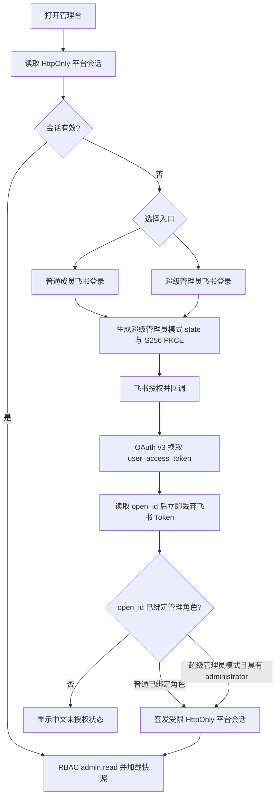
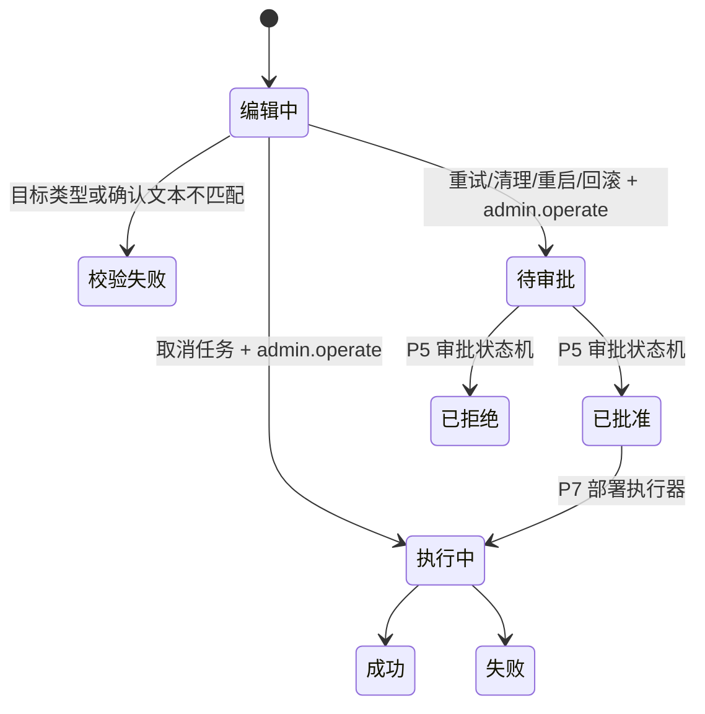

# P6 管理台页面、交互与接口规范

## 1. 设计目标

管理台采用“深色主导航 + 浅色工作区”的企业运维布局。页面必须同时满足：

1. 首屏先回答“是否健康、是否需要处理、影响范围是什么”。
2. 相同状态使用统一颜色、标签、空态、错误态和加载态。
3. 表格用于对象清单，卡片用于概览，时间线用于 Trace，表单只用于受治理写操作。
4. 所有页面支持 URL Hash 深链接，30 秒自动刷新，手工刷新不改变当前页面和筛选上下文。
5. 登录后由服务端返回可访问页面集合并过滤快照；告警确认执行 `alert.manage`，角色管理执行 `access.manage`，运维操作执行 `admin.operate`。
6. 浏览器不持有 App Secret、GitLab Token、数据库连接串或其他业务凭据。

## 2. 全局应用框架

| 区域       | 样式与内容                                                             | 交互                                                        |
| ---------- | ---------------------------------------------------------------------- | ----------------------------------------------------------- |
| 左侧导航   | 260px 深色固定导航；总览、运行管理、安全治理、平台运维、帮助五组       | 服务端按角色下发页面；点击切换 Hash；窄屏切换为顶部布局     |
| 页面标题区 | 白色吸顶；分组、标题、页面说明、角色范围、更新时间、刷新与操作说明入口 | 刷新当前快照；点击身份查看飞书会话和当前角色                |
| 内容工作区 | 浅灰背景；最大宽度内容容器；白色卡片、轻边框、统一留白；宽表格局部滚动 | 保留页面上下文；错误不覆盖已有数据                          |
| 登录页     | 普通成员和超级管理员使用独立视觉入口；两者都只提供飞书企业 SSO         | OAuth 回调恢复 HttpOnly 会话；退出时服务端撤销并清除 Cookie |
| 状态反馈   | 红色错误横幅、黄色风险提示、绿色成功空态；不得直接显示后端英文异常     | 区分取消授权、状态过期、身份未绑定角色和服务异常            |

## 3. 页面清单

| 页面          | 页面结构与样式                                                  | 核心功能                                              | 主要交互                                          | 当前读取模型                                      | 管理写接口                                   |
| ------------- | --------------------------------------------------------------- | ----------------------------------------------------- | ------------------------------------------------- | ------------------------------------------------- | -------------------------------------------- |
| 管理驾驶舱    | 蓝色管理 Hero；5 个 KPI；快捷管理卡；服务、队列、任务、告警双栏 | 健康评分、任务、审批、告警和当前管理范围              | 按权限进入角色、告警、运维、配置；任务进入 Trace  | `snapshot.summary`、`services`、`queue`、`alerts` | 无                                           |
| 任务与会话    | 状态条 + 任务主表 + 会话表                                      | 来源会话、路由、执行器、风险、重试、终态              | 状态筛选；任务行进入 Trace；复制任务 ID           | `data.tasks`、`data.conversations`                | 取消/重试进入运维操作                        |
| 队列与 Worker | 队列深度条形图 + 服务实例卡 + readiness 明细                    | waiting/active/delayed/dead-letter、Worker 在线和恢复 | 刷新；离线服务跳转告警；查看 readiness 详情       | `queue`、`services`                               | 重启必须进入审批                             |
| 执行器与沙箱  | 执行器状态卡 + 最近 run 表                                      | Direct Tool、Agent CLI、API Agent、工作区和隔离类型   | 按执行器筛选；run 进入任务 Trace                  | `data.executorRuns`、`configuration`              | 清理工作区必须审批                           |
| 系统集成      | 每个集成一张状态卡 + 配置摘要                                   | 飞书、GitLab、Confluence、API/ReAct 状态和白名单数量  | 查看安全配置；失败跳转告警；只读连通性检查        | `integrations`                                    | 当前无写操作                                 |
| 审批中心      | 3 个 KPI + 审批主表                                             | pending/approved/rejected/expired、风险和卡片同步     | 状态筛选；查看原操作；终态不可重复操作            | `data.approvals`                                  | 决策仍由 P5 飞书卡片接口完成                 |
| 用户与权限    | 角色清单 + 新增绑定表单 + 绑定表                                | 系统角色、用户/群组主体和 managed-by 来源             | 新增/移除角色；启动配置和本人超级管理员绑定受保护 | `data.roles`、`data.roleBindings`                 | `POST/DELETE /v1/admin/access/role-bindings` |
| Token 与成本  | 3 个 KPI + 分层预算进度条                                       | 用户、群组、任务、模型预算和成本                      | 预算层级筛选；80%/100% 阈值高亮                   | `data.budgets`、`summary`                         | 阈值变更属于配置发布                         |
| 日志与 Trace  | 左侧任务索引 + 关联链路 + 事件时间线 + 审计表                   | 飞书事件→任务→attempt→run→工具→错误→审计              | 选择任务；按事件类型过滤；复制 correlation ID     | `GET /v1/admin/tasks/:id/trace`                   | 无                                           |
| 告警中心      | 告警 KPI + 按严重度分组卡片                                     | 队列、服务、任务、模型和预算告警                      | 严重度/状态筛选；确认告警；跳转关联 Trace         | `data.alerts`                                     | `POST /v1/admin/alerts/:id/acknowledge`      |
| 配置中心      | 安全提示 + 分组配置清单                                         | 键名、是否配置、来源、是否需重启                      | 分组筛选；复制键名；不得显示值                    | `configuration`、`data.configVersions`            | 配置发布属于后续版本化流程                   |
| 发布与备份    | 发布表 + 备份/恢复表 + 配置版本表                               | 版本、校验和、备份校验、恢复演练                      | 版本对比；查看校验结果；发起回滚需审批            | `data.releases`、`backups`、`configVersions`      | 回滚通过 `/v1/admin/actions`                 |
| 运维操作      | 左侧操作表单 + 右侧操作记录                                     | 取消、重试、清理、重启、回滚                          | 选择动作→输入目标→复制精确确认→提交→刷新状态      | `data.operations`                                 | `POST /v1/admin/actions`                     |
| 操作说明书    | 角色工作流 + 权限矩阵 + 安全操作守则                            | 按当前角色解释可操作范围、日常流程和升级路径          | 从标题区或帮助分组进入；不展示未授权数据          | 前端内置操作说明                                  | 无                                           |

## 4. 身份与会话交互



安全约束：

- OAuth 授权请求必须校验单次 `state`，并使用 S256 PKCE；授权码只能使用一次。
- 飞书 App Secret、授权码和 `user_access_token` 只存在于 Control API；平台 Cookie 设置 `HttpOnly`、`SameSite=Lax`，HTTPS 部署额外设置 `Secure`。
- 飞书只完成身份认证，`open_id` 仍需绑定平台角色；登录本身不产生任何角色。
- 超级管理员入口不会提升权限，只接受已经绑定 `administrator` 的飞书用户。
- 管理台 UI 不提供密码、本机会话或手工 Open ID 登录；运行配置强制 `ADMIN_LOCAL_BOOTSTRAP_ENABLED=false`、`ADMIN_MANUAL_IDENTITY_ENABLED=false`。
- 服务端依据角色生成 `allowedPages`，并在返回快照前过滤无权页面的数据，不能依靠隐藏菜单代替鉴权。
- 所有平台会话默认 8 小时到期，Control API 重启或主动退出后立即失效。

## 5. 通用交互逻辑

### 5.1 读取页面

1. 进入 Hash 页面后先显示最近一次成功快照。
2. 后台刷新期间只更新刷新按钮，不清空页面。
3. 新快照成功后原子替换页面数据并更新时间。
4. 403 清理无效会话并回到身份面板；5xx 保留旧数据并显示中文错误横幅。
5. 表格空数据使用业务空态，不显示空白表格或 `null`。

### 5.2 Trace 下钻

1. 任务行点击 `Trace`，Hash 切换至 `#trace`。
2. 读取单任务 Trace；左侧保留当前任务选中状态。
3. 顶部展示来源事件、任务、执行器、工具四段链路。
4. 中部按时间合并 task event 与 executor event；失败事件红色高亮。
5. 底部展示审批和审计，所有潜在凭据再次递归脱敏。

### 5.3 受治理运维操作



取消任务是 P6 唯一可直接调用协调器的操作；其余高风险操作只登记 `pending_approval`，不在页面端直接执行。

## 6. 已实现管理接口

| 方法     | 路径                                      | 权限            | 请求                                       | 响应/说明                                                  |
| -------- | ----------------------------------------- | --------------- | ------------------------------------------ | ---------------------------------------------------------- |
| `GET`    | `/v1/admin/auth/config`                   | 公共            | 无                                         | 返回飞书登录能力和开发回退关闭状态                         |
| `GET`    | `/v1/admin/auth/feishu/start`             | 公共            | 无                                         | 302 到飞书授权页；包含 state 和 S256 PKCE                  |
| `GET`    | `/v1/admin/auth/feishu/super-admin/start` | 公共            | 无                                         | 302 到飞书授权页；state 绑定超级管理员登录模式             |
| `GET`    | `/v1/admin/auth/feishu/callback`          | 单次回调        | code/state 或 access_denied                | 成功设置 HttpOnly Cookie，失败返回中文错误码               |
| `GET`    | `/v1/admin/session`                       | 平台会话        | HttpOnly Cookie                            | 显示名、角色、来源、到期时间；不返回 open_id               |
| `POST`   | `/v1/admin/session/logout`                | 平台会话        | Cookie 或 Bearer                           | 撤销服务端会话并清空 Cookie                                |
| `GET`    | `/v1/admin/snapshot?limit=1..200`         | 已绑定平台角色  | HttpOnly 平台会话                          | 返回角色允许页面及经过服务端过滤的聚合读取模型             |
| `GET`    | `/v1/admin/tasks/:taskId/trace`           | 允许 Trace 页面 | UUID                                       | 任务、事件、attempt、run、工具事件、审批、审计             |
| `POST`   | `/v1/admin/alerts/:alertId/acknowledge`   | `alert.manage`  | UUID                                       | `{ acknowledged: true }`，同时写审计                       |
| `POST`   | `/v1/admin/actions`                       | `admin.operate` | action、targetType、targetId、confirmation | 取消返回终态；高风险返回 HTTP 202 + `pending_approval`     |
| `POST`   | `/v1/admin/access/role-bindings`          | `access.manage` | principalType、principalId、roleId         | 新增或恢复角色绑定，立即刷新策略并写审计                   |
| `DELETE` | `/v1/admin/access/role-bindings`          | `access.manage` | principalType、principalId、roleId         | 移除管理中心绑定；启动配置绑定和本人超级管理员角色不可删除 |

### 管理快照读取模型

```text
phase, generatedAt, viewer: roleIds, capabilities, allowedPages
summary: totalTasks, activeTasks, failedTasks, pendingApprovals,
         openAlerts, criticalAlerts, tokensUsed, costMicrosUsed
queue, services, integrations, configuration
data: taskCounts, tasks, conversations, approvals, executorRuns,
      roles, roleBindings, budgets, auditEvents, alerts, operations,
      releases, backups, configVersions
```

## 7. 后续细分接口

当前 P6 使用一次聚合快照保证 14 个页面的数据一致性，并按角色在服务端过滤数据。数据量增长后，按以下接口拆分；响应继续使用相同字段模型，前端无需改变视觉层：

| 接口规划                      | 查询参数                               | 用途                    |
| ----------------------------- | -------------------------------------- | ----------------------- |
| `GET /v1/admin/tasks`         | status、executor、risk、cursor、limit  | 任务分页与筛选          |
| `GET /v1/admin/conversations` | chatId、userId、cursor、limit          | 会话检索                |
| `GET /v1/admin/runtime`       | service、window                        | 队列、Worker、readiness |
| `GET /v1/admin/executor-runs` | taskId、executor、status、cursor       | run 检索                |
| `GET /v1/admin/approvals`     | status、risk、requester、cursor        | 审批检索                |
| `GET /v1/admin/access`        | principalType、principalId、roleId     | RBAC 审阅               |
| `GET /v1/admin/budgets`       | scopeType、scopeId、period             | Token/成本              |
| `GET /v1/admin/alerts`        | severity、category、status、cursor     | 告警检索                |
| `GET /v1/admin/audit`         | correlationId、actorId、action、cursor | 审计检索                |
| `GET /v1/admin/releases`      | status、cursor                         | 发布历史                |
| `GET /v1/admin/backups`       | status、cursor                         | 备份与恢复演练          |
| `GET /v1/admin/operations`    | action、status、requester、cursor      | 运维操作历史            |

细分接口必须使用游标分页、最大 `limit=200`、统一错误码、递归脱敏和服务端排序；不得把未过滤的数据库行或任意 SQL 条件暴露给浏览器。

## 8. 响应式与可访问性

- ≥1100px：指标 4 列、业务面板 2 列、集成和执行器 3 列。
- 800–1099px：指标/集成/执行器 2 列，表格局部横向滚动。
- <800px：导航收起为 68px 图标栏，页面说明和自动刷新标签隐藏，内容单列。
- 所有按钮使用原生 `button`，表单都有可见标签，键盘焦点不被覆盖。
- 状态不能只依赖颜色，必须同时显示中文标签或图标。
