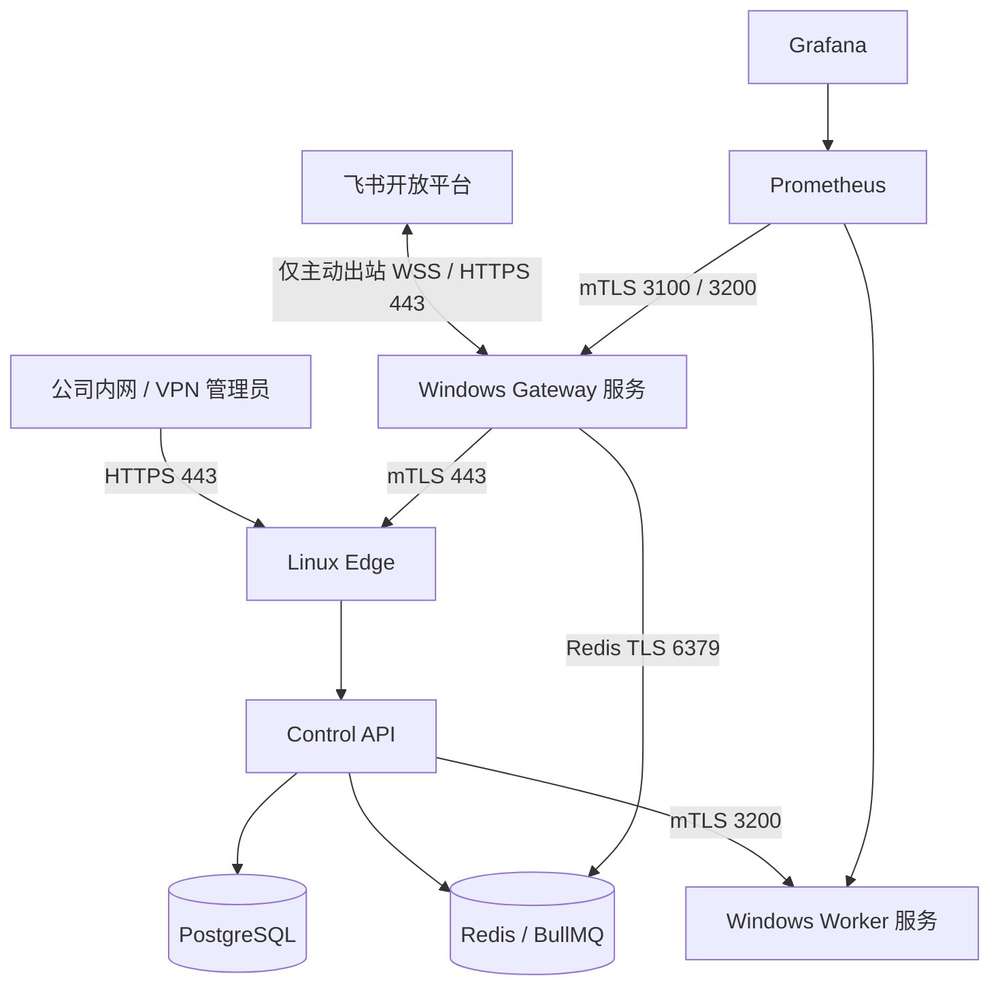

# P7 混合部署运维手册

## 1. 适用范围

本文用于 Windows 原生执行面与 Hyper-V Linux Docker 控制面的日常检查、启停、发布、回滚、备份和故障定位。P7 验收主机使用 Windows 11 Pro 25H2；目标生产环境仍应使用公司批准的 Windows Server、企业 CA 和专用服务账号基线。

P7 已于 2026-08-26 完成实机验收。当前活动版本为 `0.7.0-p7rc1`，`API_AGENT_ENABLED=false`，OpenAI API/ReAct 通道不参与路由、就绪检查或回退。

## 2. 实际拓扑



固定地址和目录：

| 项目                 | 当前值                                |
| -------------------- | ------------------------------------- |
| Windows 宿主内部地址 | `192.168.100.1/24`                    |
| Hyper-V Linux VM     | `192.168.100.10/24`                   |
| VM 配置与 VHDX       | `D:\Hyper-V\FeishuAgent-ControlPlane` |
| Windows 程序         | `D:\FeishuAgent\program`              |
| Windows 数据         | `D:\FeishuAgent\data`                 |
| Windows 备份         | `D:\FeishuAgent\backups`              |
| Linux 发布根目录     | `/opt/feishu-agent`                   |
| Linux 发布状态       | `/var/lib/feishu-agent/releases`      |

## 3. 端口与防火墙

| 目标         |     端口 | 唯一允许来源     | 用途                           |
| ------------ | -------: | ---------------- | ------------------------------ |
| Linux VM     |   22/TCP | `192.168.100.1`  | SSH 运维                       |
| Linux VM     |  443/TCP | `192.168.100.1`  | 管理台、API、Windows mTLS 通道 |
| Linux VM     | 6379/TCP | `192.168.100.1`  | Gateway Redis TLS              |
| Windows 宿主 | 3100/TCP | `192.168.100.10` | Gateway mTLS 健康与指标        |
| Windows 宿主 | 3200/TCP | `192.168.100.10` | Worker mTLS 执行、健康与指标   |

PostgreSQL、Control API、Prometheus 和 Grafana 不直接发布宿主端口。不得把上述来源扩大为 `Any`，不得配置公网端口映射；飞书消息和回复均使用 Windows Gateway 主动建立的出站连接。

## 4. 日常健康检查

在普通 PowerShell 中检查公开入口：

```powershell
Invoke-RestMethod https://feishu-agent.internal/health/ready
Invoke-WebRequest https://feishu-agent.internal/edge-health -UseBasicParsing
Invoke-RestMethod https://feishu-agent.internal/ops/grafana/api/health
Get-Service FeishuAgentGateway, FeishuAgentWorker
```

预期结果：Control API 为 `ok`，`postgres`、`bullmq`、`windows_worker` 均为 `true`；Edge 返回 `ok`；Grafana 的 `database` 为 `ok`；两个 Windows 服务均为 `Running/Automatic`。

在 Linux VM 中检查控制面：

```bash
sudo systemctl is-enabled feishu-agent-compose.service
sudo systemctl is-active feishu-agent-compose.service
sudo docker ps
sudo ufw status
sudo ss -lnt
```

应有 6 个运行容器：`postgres`、`redis`、`control-api`、`edge`、`prometheus`、`grafana`。业务监听仅为内部地址上的 443/6379；SSH 由 UFW 限定宿主来源。

## 5. 启停与重启

Windows 服务需要管理员 PowerShell：

```powershell
Restart-Service FeishuAgentGateway, FeishuAgentWorker
Get-CimInstance Win32_Service -Filter "Name='FeishuAgentGateway' OR Name='FeishuAgentWorker'"
```

Linux 控制面使用 systemd，不要在生产环境依赖 Docker Desktop：

```bash
sudo systemctl restart feishu-agent-compose.service
sudo systemctl status feishu-agent-compose.service --no-pager
```

Hyper-V VM 的自动启动策略为 `Start`，延迟 15 秒；宿主关机时使用 `ShutDown`。Windows 整机重启后应先等待 VM 和容器恢复，再检查 Windows Worker、Gateway、Prometheus 目标和一条真实 `/ping` 任务。

## 6. 发布与回滚

Windows 发布包必须先通过 SHA256 清单和内部联接边界检查，再由管理员切换：

```powershell
.\deploy\windows\Build-WindowsRelease.ps1 -Version <version>
.\deploy\windows\Test-WindowsRelease.ps1 -ReleasePath .\.runtime\p7-windows-releases\<version>
.\deploy\windows\Switch-WindowsRelease.ps1 -ReleasePath .\.runtime\p7-windows-releases\<version>
.\deploy\windows\Rollback-WindowsRelease.ps1
```

Linux 发布顺序固定为配置校验、镜像构建、数据库迁移、无队列消费金丝雀、健康检查和活动版本切换：

```bash
sudo /opt/feishu-agent/deploy/docker/Deploy-LinuxRelease.sh <version>
sudo /opt/feishu-agent/deploy/docker/Rollback-LinuxRelease.sh
```

Windows 切换失败会自动恢复前一版目录联接；Linux 数据库 migration 必须向后兼容，不允许依赖自动降级 SQL。

P7 的正式发布演练已在 2026-08-26 使用 `0.7.0-p7rc2` 完成。Linux 和 Windows 均从 `0.7.0-p7rc1` 升级到 rc2，通过各自健康检查与真实 `/ping` 后回滚 rc1；Windows Gateway/Worker 在升级和回滚后均通过 mTLS readiness，证书指纹未变化。最终活动版本和 6 个容器均恢复到 rc1，综合验收为 15/15。生产发布也必须保留相同顺序：发布包完整性校验 → 升级 → readiness → 端到端任务 → 回滚演练 → 再次 readiness 与端到端任务。

## 7. 备份与恢复

执行备份前确认 PostgreSQL/Redis 健康和备份目标容量。备份必须使用 `age` 加密、生成逐文件哈希，并保存恢复报告。具体命令和干净环境恢复流程见 [`deploy/backup/README.md`](../deploy/backup/README.md)。

每次大版本发布前至少完成一次独立 Compose 项目恢复演练，验证：

1. migration 数量与活动环境一致；
2. PostgreSQL 数据和配置可读取；
3. Redis TLS 返回 `PONG`；
4. 文件哈希和恢复报告为 `passed`；
5. 演练资源删除后，正式环境仍保持健康。

## 8. 故障定位顺序

1. 检查 Windows 是否刚重启、Hyper-V VM 的 22/443 是否可达。
2. 检查 `feishu-agent-compose.service`、6 个容器及 UFW。
3. 检查 Control API `/health/ready` 的 PostgreSQL、BullMQ、Worker 子项。
4. 检查 Gateway/Worker Windows Service、3100/3200 mTLS 和防火墙来源。
5. 检查 Prometheus 三个目标的 `health=up` 和 `lastError`。
6. 提交无模型 `/ping`，确认数据库中的 route、attempt、executor events 和 audit events。
7. 再定位飞书 WSS、企业系统、Agent CLI 或特定业务任务。

若无客户端证书的请求未在 TLS 握手阶段被拒绝，或 443/6379 绑定到 `0.0.0.0`，应立即停止发布并按安全事件处理。

## 9. P8 前置事项

- 用企业 CA 证书替换 P7 测试 PKI并完成轮换演练。
- 由安全团队确认 `LocalService` 是否需要切换为专用域服务账号及最小 ACL。
- 完成并发/峰值压测、Prompt 注入和越权测试、依赖故障演练、试点 UAT 与生产准入评审。
- 保持 OpenAI API/ReAct 通道关闭，除非后续收到明确启用指令并完成独立安全与成本评审。
